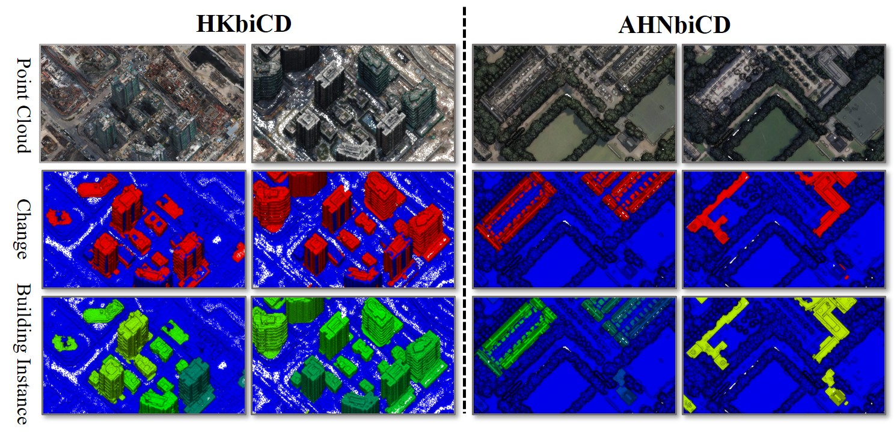

# 3DBiCD

         

# Overview
To address the lack of the 3D instance change detection dataset, improve the specificity of training data, and enhance the model's adaptability to 3D instance change detection task, we build a large-scale 3D Building instance Change Detection dataset named 3DBiCD, leveraging point cloud to comprehensively describe urban building instance changes across two temporal sequences. The dataset comprises two subsets, AHNbiCD (Utrecht, Netherlands) and HKbiCD (Hong Kong, China), each presenting building instance changes within specific geographic ranges of these cities.

## Dataset
You can download the 3DBiCD by this link "https://pan.baidu.com/s/1DubFFnj3PdHaTuuuhnGWPg" and email the "zhanwenxiao@whu.edu.cn" to get the password.
